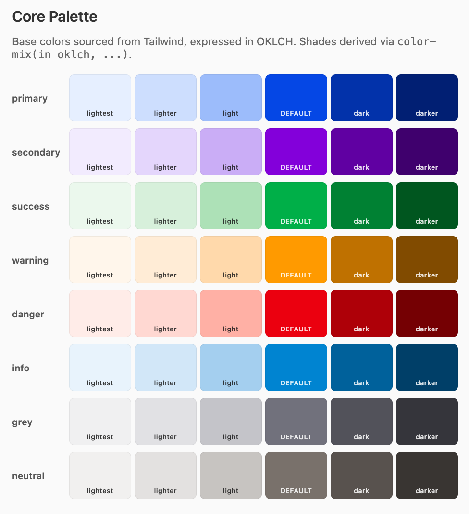
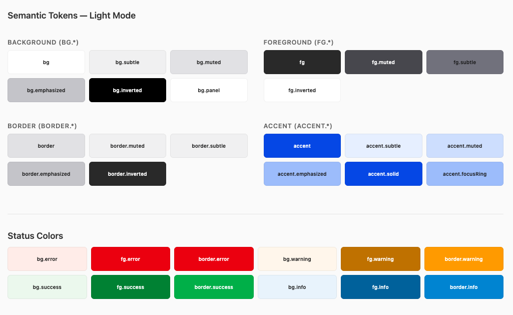

# 🦋 @workspace/design-system

A token-driven design system built on **Ark UI** and **Panda CSS**, designed to replace Radix Themes' layout and styling layer with semantic HTML, accessible primitives, and a single unified styling system.

> **Key links:**
>
> - [Ark UI](https://ark-ui.com) — Headless, accessible UI primitives (by the Chakra team)
> - [Panda CSS](https://panda-css.com) — Zero-runtime CSS-in-JS with design token support
> - [Zag.js](https://zagjs.com) — State machine engine powering Ark UI
> - [Ark UI Blog: Building a Design System](https://ark-ui.com/blog/design-system-series) — Tutorial this package follows

---

## Design Philosophy

### The problem

Pages were built with deep nesting of `<Flex>`, `<Box>`, and `<Text>` from Radix Themes — components that exist only to apply layout CSS. Each adds a real DOM node with `.rt-` classes, leading to:

- Unnecessary nesting depth for trivial layouts
- Specificity wars between Radix `.rt-` classes and custom Emotion styles
- Four competing styling systems (Emotion, Tailwind, styled-components, Radix Themes props)

### The solution

**Separate behavior from styling, and styling from layout.**

| Layer                   | Tool                      | Responsibility                                     |
| ----------------------- | ------------------------- | -------------------------------------------------- |
| **Accessible behavior** | Ark UI primitives         | Keyboard, focus, ARIA, state machines              |
| **Design tokens**       | Panda CSS preset          | Colors, spacing, typography, shadows               |
| **Component styling**   | Panda CSS recipes (`cva`) | Button variants, badge colors, input sizes         |
| **Layout**              | Semantic HTML + CSS       | `<section>`, `<fieldset>`, `<label>`, flexbox/grid |

No `<Flex>`. No `<Text>`. No `<Box>`. Just HTML elements styled by one system.

---

## What came from where

### From the Ark UI blog post

- **Preset architecture** — tokens, recipes, and global CSS bundled as a Panda CSS preset
- **Semantic token structure** — `bg.*`, `fg.*`, `border.*`, `accent.*` naming convention
- **Button recipe pattern** — `cva()` with `base`, `variants`, `compoundVariants`, `defaultVariants`
- **CSS reset** — normalized preflight for cross-browser consistency
- **Keyframe animations** — `slide-fade-in`, `slide-fade-out` for component transitions
- **Global CSS layering** — `reset.css` → `keyframes.css` → `global.css` import order

### From the existing `apps/client/src/styles/`

- **OKLCH color space** — all base colors remain in OKLCH (perceptually uniform), sourced directly from `colors.source.ts`
- **Tailwind-derived base palette** — primary (blue-700), secondary (purple-700), success (green-600), warning (amber-500), danger (red-600), info (cyan-500), grey (zinc-500), neutral (stone-500)
- **Font stacks** — system font stack from `typography.constants.ts`, mono stack from `fonts/typography.contants.ts`
- **Font scale** — xs through 6xl, matching existing `fontSize` definitions exactly
- **Font weights** — thin through black (100-900), matching existing `fontWeight` constants
- **Line heights** — none, tight, snug, normal, relaxed, loose — from existing system
- **Spacing scale** — mapped from `base.constants.ts` values (xs=0.25rem through xxxxl=2.25rem), extended with half-steps
- **Border radii** — none through full, matching `border.radius` values from `base.constants.ts`
- **Border widths** — none/light/default/heavy from existing `border.width` definitions
- **Breakpoints** — Radix UI breakpoints (xs:0, sm:520, md:768, lg:1024, xl:1280, xxl:1640) from `viewport.breakpoints.ts`
- **Button constants** — sizes, border width, disabled opacity, transition timing from `button.constants.ts`
- **Status-to-color mapping** — error=danger, warning=warning, success=success, info=info pattern from existing UI types
- **Shade generation approach** — existing system uses OKLCH lightness/chroma manipulation; this package uses `color-mix(in oklch, ...)` for the same effect with zero build cost

### New in this package

- **Semantic tokens with dark mode** — every semantic token has `base` and `_dark` conditions
- **Component recipes** — badge, callout, input, switch (beyond the blog's button-only example)
- **Compound variants** — `variant="solid" colorScheme="danger"` works as a single prop combination
- **z-index scale** — structured from `base` through `tooltip` for consistent layering
- **Duration + easing tokens** — animation timing as first-class tokens
- **Text styles** — composite tokens combining fontSize, fontWeight, and lineHeight

---

## Color Palette

All colors use the **OKLCH color space** for perceptually uniform shade generation.

> **Preview:** Open `docs/color-palette-preview.html` in a browser to see the full palette rendered.
> Screenshot it for use in documentation.





### How shades are generated

Base colors are defined as OKLCH values. Shades are derived using CSS `color-mix()`:

```css
/* Lighter shades — mix with white (% of base) */
color-mix(in oklch, oklch(48.8% 0.243 264.376)  5%, white)  /* primary.xxxlight */
color-mix(in oklch, oklch(48.8% 0.243 264.376) 10%, white)  /* primary.xxlight  */
color-mix(in oklch, oklch(48.8% 0.243 264.376) 20%, white)  /* primary.xlight   */
color-mix(in oklch, oklch(48.8% 0.243 264.376) 38%, white)  /* primary.lighter  */
color-mix(in oklch, oklch(48.8% 0.243 264.376) 58%, white)  /* primary.light    */

/* Base */
oklch(48.8% 0.243 264.376)                                  /* primary / primary.base */

/* Darker shades — mix with black (% of base) */
color-mix(in oklch, oklch(48.8% 0.243 264.376) 82%, black)  /* primary.dark    */
color-mix(in oklch, oklch(48.8% 0.243 264.376) 65%, black)  /* primary.darker  */
color-mix(in oklch, oklch(48.8% 0.243 264.376) 47%, black)  /* primary.xdark   */
color-mix(in oklch, oklch(48.8% 0.243 264.376) 30%, black)  /* primary.xxdark  */
color-mix(in oklch, oklch(48.8% 0.243 264.376) 15%, black)  /* primary.xxxdark */
```

This happens in the browser at runtime — no build step, no code generation, stays in OKLCH space.

### Token levels

```
┌─────────────────────────────────────────────────────┐
│  Raw Tokens (what colors ARE)                       │
│  colors.primary = oklch(48.8% 0.243 264.376)        │
│  colors.danger.light = color-mix(... 58%, white)    │
├─────────────────────────────────────────────────────┤
│  Semantic Tokens (what colors MEAN)                 │
│  bg.error = colors.danger.xlight                    │
│  fg.error = colors.danger                           │
│  border.error = colors.danger                       │
├─────────────────────────────────────────────────────┤
│  Recipes (how components USE tokens)                │
│  callout({ status: 'error' })                       │
│    → bg: bg.error, color: fg.error, border: ...     │
└─────────────────────────────────────────────────────┘
```

---

## Folder Structure

```
packages/design-system/
├── panda.config.ts              ← Panda config for this package (codegen + type-checking)
├── tsup.config.ts               ← Build config (ESM + declaration files)
├── tsconfig.json
├── package.json                 ← @workspace/design-system
├── docs/
│   └── color-palette-preview.html  ← Open in browser to preview all colors
└── src/
    ├── index.ts                 ← Main entry — re-exports everything
    ├── panda.preset.ts          ← THE PRESET — import this in consuming apps
    │
    ├── tokens/                  ← Design tokens (the vocabulary)
    │   ├── index.ts
    │   ├── colors.ts            ← OKLCH base palette + semantic color tokens
    │   ├── typography.ts        ← Font families, sizes, weights, text styles
    │   ├── spacing.ts           ← Spacing, radii, borders, shadows, breakpoints
    │   └── animations.ts        ← Keyframes, durations, easings
    │
    ├── recipes/                 ← Component style definitions (the rules)
    │   ├── index.ts
    │   ├── button.ts            ← Size + variant + colorScheme
    │   ├── badge.ts             ← Replaces Radix <Badge>
    │   ├── callout.ts           ← Replaces Radix <Callout.Root>
    │   ├── input.ts             ← Form input styling
    │   └── switch.ts            ← Toggle switch control
    │
    ├── grid/                    ← Responsive 12-column grid (import: @workspace/design-system/grid)
    │   ├── index.ts             ← Barrel: Row, Col, Container
    │   ├── Col.tsx              ← Responsive column — xs/sm/md/lg/xl/xxl props
    │   ├── Row.tsx              ← Flex row — align/justify/wrap/nogutter/gutterWidth
    │   ├── Container.tsx        ← Max-width wrapper — fluid prop
    │   └── grid.css             ← Pre-generated stylesheet (import separately)
    │
    ├── components/              ← Ark UI wrappers (the building blocks)
    │   ├── index.ts
    │   ├── button.tsx           ← ark.button + recipe integration
    │   ├── switch.tsx           ← Ark Switch compound component
    │   ├── dialog.tsx           ← Re-export of Ark Dialog
    │   ├── checkbox.tsx         ← Re-export of Ark Checkbox
    │   └── toast.tsx            ← Re-export of Ark Toast + createToaster
    │
    └── styles/                  ← Static CSS files
        ├── global.css           ← Aggregator — imports reset + keyframes
        ├── reset.css            ← Browser normalization / preflight
        └── keyframes.css        ← Animation definitions
```

---

## CSS Files — Purpose and Import Order

Import `global.css` once at your app entry point. It loads the others in the correct order:

```ts
// apps/client/src/main.tsx
import '@workspace/design-system/styles/global.css';
```

| File            | Purpose                                                                                                                       |
| --------------- | ----------------------------------------------------------------------------------------------------------------------------- |
| `reset.css`     | Removes browser defaults. Normalizes box-sizing, typography, form elements, media elements. Loaded **first**.                 |
| `keyframes.css` | Defines reusable `@keyframes` animations (`slide-fade-in`, `fade-in`, `scale-in`, etc.) used by Ark UI component transitions. |
| `global.css`    | Aggregates the above two via `@import`. This is the only file you import.                                                     |

> **Note:** Component styles are NOT in CSS files — they're defined as Panda CSS recipes and applied via generated utility classes at build time.

---

## Design Token Anatomy

### Token files and what they define

| File            | Tokens                                                                                             | Example usage in recipes                                     |
| --------------- | -------------------------------------------------------------------------------------------------- | ------------------------------------------------------------ |
| `colors.ts`     | `colorTokens` (raw palette), `semanticColorTokens` (role-based)                                    | `bg: 'accent.solid'`, `color: 'fg.inverted'`                 |
| `typography.ts` | `fontTokens`, `fontSizeTokens`, `fontWeightTokens`, `lineHeightTokens`, `textStyles`               | `fontSize: 'sm'`, `fontWeight: 'semibold'`                   |
| `spacing.ts`    | `spacingTokens`, `radiiTokens`, `borderWidthTokens`, `shadowTokens`, `breakpoints`, `zIndexTokens` | `padding: '4'`, `borderRadius: 'md'`, `gap: '2'`             |
| `animations.ts` | `keyframes`, `durationTokens`, `easingTokens`                                                      | `transitionDuration: 'normal'`, `animation: 'slide-fade-in'` |

### Using tokens directly (in Panda CSS styles)

```tsx
import { css } from '../styled-system/css';

// Tokens are referenced by their key names
const cardStyle = css({
  bg: 'bg.panel', // semantic color token
  border: '1px solid',
  borderColor: 'border', // semantic color token
  borderRadius: 'md', // radii token → 0.5rem
  padding: '4', // spacing token → 1rem
  shadow: 'md', // shadow token
  color: 'fg', // semantic color token
});
```

### Using text styles

```tsx
import { css } from '../styled-system/css';

const headingStyle = css({
  textStyle: 'heading.3', // → fontSize: 2.25rem, fontWeight: 600, lineHeight: 1.375
  color: 'fg',
});
```

---

## Component Recipes — Philosophy and Usage

### Why recipes?

A recipe bundles all visual variants of a component into one definition. Instead of writing conditional CSS:

```tsx
// ❌ Without recipes — scattered logic
<button className={`btn ${size === 'lg' ? 'btn-lg' : 'btn-md'} ${variant === 'solid' ? 'btn-solid' : 'btn-outline'}`}>
```

You get a typed, composable function:

```tsx
// ✅ With recipes — single call, full type safety
<button className={button({ size: 'lg', variant: 'solid' })}>
```

### Button

Replaces the existing `<Button>` + inner `<Flex>` pattern. Icons and text are laid out by the button itself.

```tsx
import { button } from '../styled-system/recipes';

// Simple
<button className={button({ variant: 'solid', size: 'md' })}>
  Save
</button>

// With icon — no wrapper needed, gap is built into the recipe
<button className={button({ variant: 'outline', size: 'md' })}>
  <PlusIcon />
  Add Column
</button>

// With color scheme
<button className={button({ variant: 'outline', colorScheme: 'warning' })}>
  <MinusIcon />
  Remove Column
</button>
```

**Variants:** `size` (sm, md, lg) · `variant` (solid, subtle, outline, ghost) · `colorScheme` (primary, success, warning, danger, info, neutral)

### Badge

Replaces Radix `<Badge>`. A plain `<span>` with recipe classes.

```tsx
import { badge } from '../styled-system/recipes';

<span className={badge({ variant: 'soft', colorScheme: 'info', size: 'lg' })}>
  3 columns × 4 rows = 12 grid slots + 1 special slot
</span>;
```

**Variants:** `size` (sm, md, lg) · `variant` (solid, soft, outline) · `colorScheme` (primary, success, warning, danger, info, neutral)

### Callout

Replaces Radix `<Callout.Root>` + `<Callout.Text>`. One element, one recipe.

```tsx
import { callout } from '../styled-system/recipes';

// Before (Radix Themes — 2 components, nested)
<Callout.Root color="red">
  <Callout.Text>Error: {error}</Callout.Text>
</Callout.Root>

// After (1 element, flat)
<div className={callout({ status: 'error' })} role="alert">
  Error: {error}
</div>
```

**Variants:** `status` (error, warning, success, info)

### Input

Base styling for form inputs. Works with plain `<input>` or Ark UI form primitives.

```tsx
import { input } from '../styled-system/recipes';

<input
  className={input({ size: 'md' })}
  type="text"
  placeholder="Enter value..."
/>;
```

**Variants:** `size` (sm, md, lg)

### Switch

Styling for Ark UI's `<Switch>` compound component. Ark handles all a11y (role, aria-checked, keyboard).

```tsx
import { Switch } from '@workspace/design-system/components';

<Switch
  label="Minimal layout (4 slots, 2×2)"
  checked={isMinimal}
  onCheckedChange={({ checked }) => handleToggle(checked)}
/>;
```

Or with the recipe directly on Ark primitives:

```tsx
import { Switch as ArkSwitch } from '@ark-ui/react';
import { switchRecipe } from '../styled-system/recipes';

<ArkSwitch.Root>
  <ArkSwitch.Control className={switchRecipe({ size: 'md' })}>
    <ArkSwitch.Thumb className="switch-thumb" />
  </ArkSwitch.Control>
  <ArkSwitch.Label>Enable feature</ArkSwitch.Label>
  <ArkSwitch.HiddenInput />
</ArkSwitch.Root>;
```

**Variants:** `size` (sm, md, lg)

---

## Layout System

Two complementary layers handle all layout needs. They replace `react-grid-system`, Radix `<Flex>`, `<Box>`, `<Grid>`, and `<Container>`.

### Layer 1 — Responsive Grid (`@workspace/design-system/grid`)

Bootstrap-style 12-column flex grid. Import the CSS once, then use the components anywhere.

```tsx
// main.tsx — import once
import '@workspace/design-system/grid/grid.css';

// anywhere in the app
import { Row, Col, Container } from '@workspace/design-system/grid';
```

**`Container`** — max-width page wrapper

```tsx
<Container>full-width layout</Container>
<Container fluid>100% width (no max-width cap)</Container>
```

**`Row`** — flex row with gutter management

```tsx
<Row>                          {/* default: flex-wrap, gutter 16px */}
<Row align="center">           {/* align-items */}
<Row justify="space-between">   {/* justify-content */}
<Row nogutter>                 {/* removes gutter (margin + padding) */}
<Row gutterWidth={24}>         {/* overrides --ds-grid-gutter */}
<Row direction="column">       {/* flex-direction */}
<Row wrap="nowrap">            {/* flex-wrap */}
```

**`Col`** — responsive column (mobile-first, 1–12 or `'content'`)

```tsx
<Col xs={12} md={6} lg={4}>   {/* full → half → third */}
<Col xs={12} md={8}>          {/* full → two-thirds */}
<Col xs="content">            {/* shrinks to content width */}

{/* Dynamic values work too */}
const colSize = Math.floor(12 / numCols);
<Col xs={colSize} />
```

**Breakpoints:**

| Prop | Min-width | Tailwind equiv |
|---|---|---|
| `xs` | base (no query) | — |
| `sm` | 640px | `sm:` |
| `md` | 768px | `md:` |
| `lg` | 1024px | `lg:` |
| `xl` | 1280px | `xl:` |
| `xxl` | 1536px | `2xl:` |

**Spread props work** — useful when col widths come from config objects:

```tsx
const left = { xs: 12, md: 4, lg: 3 };
<Col {...left} className="sidebar" />
```

---

### Layer 2 — Spacing Wrappers (`styled-system/jsx`)

Generated by Panda CSS (`jsxFramework: 'react'`). Accept all Panda style props including responsive objects. Use for spacing and composition — **not** for flex-grid layout.

```tsx
import { Box, Stack, HStack, VStack } from '../styled-system/jsx';
```

**`Box`** — generic wrapper with full token + spacing support

```tsx
<Box p="4" bg="bg.panel" borderRadius="md">
  content
</Box>

{/* Responsive spacing */}
<Box px={{ base: '3', md: '6' }} py="4">
  content
</Box>
```

**`Stack` / `VStack`** — vertical flex stack with gap

```tsx
<Stack gap="3">
  <label>...</label>
  <input />
  <span>hint text</span>
</Stack>
```

**`HStack`** — horizontal flex stack with gap

```tsx
<HStack gap="2" align="center">
  <Icon />
  <span>Label</span>
</HStack>
```

---

### When to use which

| Situation | Use |
|---|---|
| Responsive column layout (1–12) | `Row` + `Col` |
| Max-width page wrapper | `Container` |
| Simple flex group with gap | `HStack` / `VStack` |
| Spacing / background / border on a div | `Box` |
| CSS grid layout | `div` + `css({ display: 'grid', ... })` |
| Text/heading with token styling | `span`/`p`/`h1` + `css({ textStyle: '...' })` |

> **`Flex` is generated but not used.** `Row` is the flex primitive. Using both creates ambiguity.

---

## Consuming the Preset

### 1. Install

```bash
pnpm add @workspace/design-system --filter @workspace/client
```

### 2. Configure Panda CSS in the consuming app

```ts
// apps/client/panda.config.ts
import { defineConfig } from '@pandacss/dev';
import { designSystemPreset } from '@workspace/design-system/panda.preset';

export default defineConfig({
  presets: ['@pandacss/dev/presets', designSystemPreset],
  include: ['./src/**/*.{ts,tsx}'],
  outdir: 'styled-system',
  jsxFramework: 'react', // generates Box, Stack, HStack, VStack etc. in styled-system/jsx
});
```

### 3. Import global styles

```tsx
// apps/client/src/main.tsx
import '@workspace/design-system/styles/global.css';
```

### 4. Run Panda codegen

```bash
pnpm panda codegen
```

This generates `styled-system/` in the consuming app with typed utilities:

```ts
import { css } from '../styled-system/css';
import { button, badge, callout } from '../styled-system/recipes';
```

### 5. Use in components

```tsx
import { css } from '../styled-system/css';
import { button, callout } from '../styled-system/recipes';
import { Switch } from '@workspace/design-system/components';

export const MyPage = () => (
  <section className={css({ padding: '4', bg: 'bg.panel' })}>
    <h1 className={css({ textStyle: 'heading.3', color: 'fg' })}>
      Settings
    </h1>

    {error && (
      <div className={callout({ status: 'error' })} role="alert">
        {error}
      </div>
    )}

    <Switch
      label="Dark mode"
      checked={isDark}
      onCheckedChange={({ checked }) => setIsDark(checked)}
    />

    <button className={button({ variant: 'solid', size: 'md' })}>
      Save Changes
    </button>
  </section>
);
```

---

## Before / After

### Page layout (AdminPageLayout)

```tsx
// ❌ Before — Radix Themes wrappers
<Flex justify="space-between" align="center" gap="4">
  <Flex className="header-left" style={{ flex: '1 1 auto', minWidth: 0 }}>
    <Title ... />
  </Flex>
  <Flex gap="3" align="center" justify="end">
    {headerActions}
  </Flex>
</Flex>

// ✅ After — semantic HTML + CSS
<header className={css({ display: 'flex', justify: 'space-between', align: 'center', gap: '4' })}>
  <div className={css({ flex: '1', minWidth: 0 })}>
    <Title ... />
  </div>
  {headerActions && (
    <nav className={css({ display: 'flex', gap: '3', alignItems: 'center' })}>
      {headerActions}
    </nav>
  )}
</header>
```

### Switch + label

```tsx
// ❌ Before — 5 components for a toggle
<Flex direction="column" gap="2" pt="2">
  <Text size="3" weight="bold" mb="2">Layout mode</Text>
  <Flex align="center" gap="2">
    <Switch checked={isMinimal} onCheckedChange={handleToggle} />
    <Text size="2" weight="medium">Minimal (4 slots, 2×2)</Text>
  </Flex>
</Flex>

// ✅ After — 1 component
<Switch
  label="Minimal layout (4 slots, 2×2)"
  checked={isMinimal}
  onCheckedChange={({ checked }) => handleToggle(checked)}
/>
```

### Legend items

```tsx
// ❌ Before — Flex + Text per item
<Flex align="center" gap="4">
  <div className="legend-circle legend-type-a">A</div>
  <Text size="3">Type A</Text>
</Flex>

// ✅ After — plain HTML
<div className={css({ display: 'flex', alignItems: 'center', gap: '4' })}>
  <div className="legend-circle legend-type-a">A</div>
  <span>Type A</span>
</div>
```
